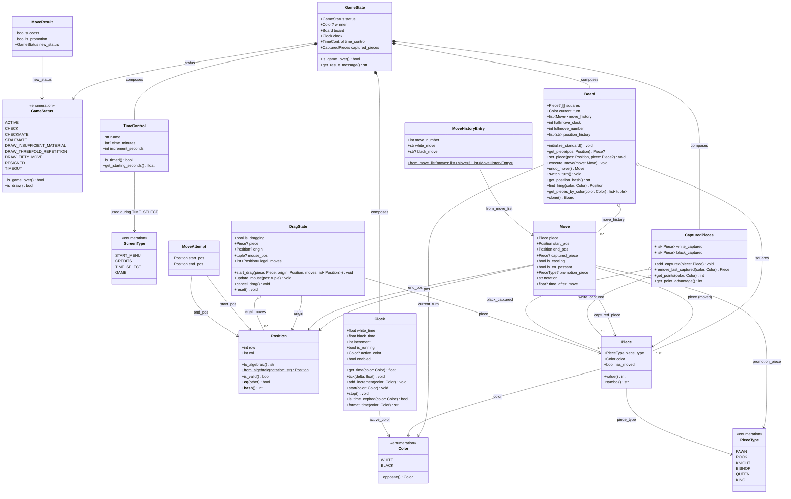

# Entity Class Diagram

This document defines the entity classes for the chess application. Entity classes hold data and basic behavior only — no UI code, no complex game rules. They map directly from the [Data Dictionary](data-dictionary.md).

---

## Class Diagram

---

## Class Descriptions

### Enumerations

| Enum | Purpose | Notes |
|------|---------|-------|
| `ScreenType` | Identifies which screen is currently displayed | Values: START_MENU, CREDITS, TIME_SELECT, GAME |
| `Color` | Identifies player/piece color | `opposite()` returns BLACK for WHITE and vice versa |
| `PieceType` | Identifies the type of chess piece | Standard six piece types |
| `GameStatus` | Tracks the current game status | `is_game_over()` returns true for CHECKMATE, STALEMATE, all draws, RESIGNED, TIMEOUT. `is_draw()` returns true for STALEMATE and DRAW_* values. |

### Data Classes (Immutable / Value Types)

| Class | Purpose |
|-------|---------|
| `Position` | Represents a square on the board (row 0-7, col 0-7). Supports algebraic notation conversion and equality/hashing for use in sets and dicts. |
| `Piece` | Represents a single chess piece with its type, color, and move history. `value()` returns standard point value. `symbol()` returns unicode character. |
| `Move` | Represents a single move with all metadata needed for undo (captured piece, special move flags, clock time). |
| `TimeControl` | Represents a time control preset. `is_timed()` returns false when time_minutes is None. `get_starting_seconds()` converts minutes to seconds. |
| `MoveHistoryEntry` | Display-oriented pairing of white and black moves for the move history panel. `from_move_list()` converts raw Move list to display entries. |
| `MoveResult` | Returned by GameController after a move attempt. Indicates success, whether promotion is needed, and the resulting game status. |
| `MoveAttempt` | Input to GameController from InputController. Pairs a start and end position for move validation. |

### Stateful Classes

| Class | Purpose |
|-------|---------|
| `Board` | The 8x8 game board. Holds pieces in a 2D array, tracks turns, move history, and position history for draw detection. `clone()` creates a deep copy for move validation without mutating game state. |
| `Clock` | Manages both players' chess clocks. `tick()` decrements the active player's time. `add_increment()` adds the increment after a move. `format_time()` returns a display string (e.g., "05:00"). |
| `GameState` | Top-level game container. Composes Board, Clock, TimeControl, and CapturedPieces. `get_result_message()` returns a human-readable result string (e.g., "Checkmate! White wins."). |
| `CapturedPieces` | Tracks captured pieces for both players. `get_points()` sums point values. `get_point_advantage()` returns the difference. |
| `DragState` | Tracks the current drag-and-drop interaction. `start_drag()` captures the piece, origin, and legal moves. `cancel_drag()` restores state if dropped on an invalid square. |
