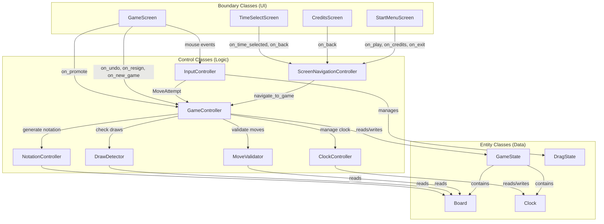

# Control Classes

This document identifies the control (logic) classes for the chess application. Control classes contain application logic, mediating between [boundary classes](boundary-classes.md) (UI) and [entity classes](class-diagram.md) (data). Game logic is cleanly separated from UI code per [NFR-04.1](non-functional-requirements.md). The architecture is extensible for future AI and multiplayer features per [NFR-06.1](non-functional-requirements.md).

---

## Control Class Summary

| Control Class | Responsibility | FR Coverage |
|---|---|---|
| `GameController` | Central orchestrator — owns GameState, dispatches actions, checks end conditions | FR-04, FR-08, FR-13, FR-14, FR-15, FR-16 |
| `MoveValidator` | Chess move legality — piece rules, path obstruction, check/pin detection, special moves | FR-07, FR-09, FR-10 |
| `DrawDetector` | Draw condition detection — insufficient material, threefold repetition, fifty-move rule | FR-11 |
| `ClockController` | Real-time clock countdown and timeout detection | FR-12 |
| `ScreenNavigationController` | Screen transitions — owns current ScreenType | FR-01, FR-02, FR-03 |
| `InputController` | Translates Pygame mouse events into game actions — manages DragState | FR-06 |
| `NotationController` | Generates standard algebraic notation for moves | FR-14 |

---

## Detailed Control Class Specifications

### GameController

**Responsibility**: Central orchestrator for the game. Owns the `GameState` instance. Receives high-level actions from boundary classes and `InputController`, dispatches to specialist controllers (`MoveValidator`, `DrawDetector`, `ClockController`, `NotationController`), and checks end-of-game conditions after each move.

**Owns**: `GameState`, references to all other control classes

**Key Methods**:

| Method | Description | Triggers |
|--------|-------------|----------|
| `new_game(time_control: TimeControl)` | Initializes a new game: creates Board (standard position), Clock, CapturedPieces, sets status to ACTIVE | FR-04.1, FR-04.2, FR-04.3 |
| `attempt_move(attempt: MoveAttempt) → MoveResult` | Validates move via MoveValidator, executes on Board, updates captured pieces, generates notation, switches turn, checks for check/checkmate/stalemate/draw, updates clock | FR-07, FR-08, FR-10, FR-11, FR-13 |
| `attempt_promotion(piece_type: PieceType) → MoveResult` | Completes a pending promotion: replaces pawn with selected piece, checks end conditions | FR-09.3 |
| `undo_last_move()` | Reverts the last move on the Board, restores clock time, restores captured pieces, recalculates game status | FR-15.1 |
| `resign(color: Color)` | Sets status to RESIGNED, sets winner to opponent | FR-15.2 |
| `get_legal_moves(position: Position) → list[Position]` | Delegates to MoveValidator to get legal destinations for the piece at the given position | FR-06.3, FR-07 |
| `update(delta: float)` | Called each frame — updates ClockController, checks for timeout | FR-12.1, FR-12.3 |

**Collaborators**: MoveValidator, DrawDetector, ClockController, NotationController

---

### MoveValidator

**Responsibility**: All chess move legality. Determines which moves are legal for any piece, considering piece movement rules, path obstruction, check/pin detection, and special move conditions (castling, en passant). Does **not** mutate game state — operates on a Board (or clone) in a read-only fashion.

**Owns**: No state (stateless — receives Board as parameter)

**Key Methods**:

| Method | Description | FR Coverage |
|--------|-------------|-------------|
| `get_legal_moves(board: Board, position: Position) → list[Position]` | Returns all legal destination squares for the piece at the given position, filtering out moves that leave own king in check | FR-07 |
| `is_in_check(board: Board, color: Color) → bool` | Returns whether the given color's king is currently in check | FR-10.1 |
| `is_checkmate(board: Board, color: Color) → bool` | Returns whether the given color is in checkmate (in check + no legal moves) | FR-10.3 |
| `is_stalemate(board: Board, color: Color) → bool` | Returns whether the given color is in stalemate (not in check + no legal moves) | FR-10.4 |
| `is_square_attacked(board: Board, position: Position, by_color: Color) → bool` | Returns whether the given square is attacked by any piece of the specified color | FR-09.1.4 |

**Private Helpers** (per piece type):

| Helper | Description |
|--------|-------------|
| `_get_pawn_moves(board, position)` | Forward moves, double-move from start, diagonal captures, en passant |
| `_get_rook_moves(board, position)` | Horizontal and vertical sliding |
| `_get_bishop_moves(board, position)` | Diagonal sliding |
| `_get_queen_moves(board, position)` | Combines rook + bishop moves |
| `_get_king_moves(board, position)` | Single-square moves + castling |
| `_get_knight_moves(board, position)` | L-shaped jumps |
| `_get_castling_moves(board, position)` | Kingside and queenside castling with all precondition checks (FR-09.1.1 through FR-09.1.6) |
| `_filter_check_moves(board, moves, color)` | Removes moves that would leave own king in check (FR-07.3) |

---

### DrawDetector

**Responsibility**: Detects all four draw conditions. Separated from `MoveValidator` because draw detection involves different data: position history (threefold repetition), material counting (insufficient material), and the halfmove clock (fifty-move rule).

**Owns**: No state (stateless — receives Board as parameter)

**Key Methods**:

| Method | Description | FR Coverage |
|--------|-------------|-------------|
| `check_draw_conditions(board: Board) → GameStatus?` | Checks all draw conditions in order, returns the first matching draw status or None | FR-11 |
| `is_insufficient_material(board: Board) → bool` | Returns true when neither side can force checkmate. Covers: K vs K, K+B vs K, K+N vs K, K+B vs K+B (same color bishops) | FR-11.2 |
| `is_threefold_repetition(board: Board) → bool` | Returns true when the current position has occurred three or more times in `position_history` | FR-11.3 |
| `is_fifty_move_rule(board: Board) → bool` | Returns true when `halfmove_clock` reaches 100 (50 full moves without a pawn move or capture) | FR-11.4 |

---

### ClockController

**Responsibility**: Manages real-time clock countdown and timeout detection. Wraps the `Clock` entity with frame-based update logic.

**Owns**: Reference to `Clock` (within GameState)

**Key Methods**:

| Method | Description | FR Coverage |
|--------|-------------|-------------|
| `initialize(time_control: TimeControl)` | Sets up initial clock times from the time control; disables clock if not timed | FR-04.3 |
| `start_clock(color: Color)` | Starts the countdown for the specified player | FR-12.1 |
| `stop_clock()` | Pauses the clock (used during promotion selection, game over) | FR-12.1 |
| `update(delta: float) → bool` | Ticks the active clock by delta seconds; returns true if time has expired | FR-12.1, FR-12.3 |
| `switch_turn(color: Color)` | Adds increment to the player who just moved, starts the opponent's clock | FR-12.2 |

---

### ScreenNavigationController

**Responsibility**: Manages screen transitions. Owns the current `ScreenType` and provides methods for each valid transition. Ensures only valid navigation paths are followed (matching the [Dialog Map](dialog-map.md)).

**Owns**: `current_screen: ScreenType`

**Key Methods**:

| Method | Description | FR Coverage |
|--------|-------------|-------------|
| `navigate_to_credits()` | Sets screen to CREDITS | FR-02.1 |
| `navigate_to_time_select()` | Sets screen to TIME_SELECT | FR-03.1 |
| `navigate_to_game(time_control: TimeControl)` | Sets screen to GAME, triggers GameController.new_game() | FR-03.4, FR-04 |
| `navigate_to_start_menu()` | Sets screen to START_MENU | FR-01.1, FR-02.3 |
| `handle_exit()` | Closes the application | FR-01.3 |

---

### InputController

**Responsibility**: Translates raw Pygame mouse events into game-level actions. Manages `DragState` for drag-and-drop piece interaction. Handles pixel-to-board coordinate mapping.

**Owns**: `DragState`

**Key Methods**:

| Method | Description | FR Coverage |
|--------|-------------|-------------|
| `handle_mouse_down(pixel_pos: tuple, board: Board) → None` | Converts pixel position to board position; if own piece is there, starts drag (populates DragState with legal moves from GameController) | FR-06.1, FR-06.6 |
| `handle_mouse_motion(pixel_pos: tuple) → None` | Updates DragState.mouse_pos for rendering the dragged piece at cursor | FR-06.2 |
| `handle_mouse_up(pixel_pos: tuple) → MoveAttempt?` | Converts pixel position to board position; if valid destination, returns MoveAttempt; otherwise cancels drag | FR-06.4, FR-06.5 |
| `pixel_to_board_position(pixel_pos: tuple) → Position?` | Converts screen pixel coordinates to a board Position, accounting for board offset and square size; returns None if off the board | FR-06 |

---

### NotationController

**Responsibility**: Generates standard algebraic notation for moves. Handles disambiguation (when multiple pieces of the same type can reach the same square), castling notation, check/checkmate symbols, and promotion notation.

**Owns**: No state (stateless — receives Board and Move as parameters)

**Key Methods**:

| Method | Description | FR Coverage |
|--------|-------------|-------------|
| `generate_notation(board: Board, move: Move) → str` | Produces the full algebraic notation string for a move (e.g., "Nf3", "O-O", "exd5", "e8=Q+") | FR-14.1 |
| `needs_disambiguation(board: Board, move: Move) → str` | Returns the disambiguation string (file, rank, or both) needed when multiple pieces of the same type can reach the target square | FR-14.1 |

**Notation Rules**:

| Scenario | Format | Example |
|----------|--------|---------|
| Normal move | [Piece][disambiguation][destination] | Nf3, Rae1 |
| Capture | [Piece][disambiguation]x[destination] | Bxe5, exd5 |
| Kingside castling | O-O | O-O |
| Queenside castling | O-O-O | O-O-O |
| Promotion | [destination]=[Piece] | e8=Q |
| Check | append + | Nf3+ |
| Checkmate | append # | Qh7# |

---

## Control Class Interaction Diagram

---

## Functional Requirement Coverage Matrix

Cross-reference verifying every functional requirement is covered by at least one control class:

| FR | Description | Control Class(es) |
|----|-------------|-------------------|
| FR-01 | Start Menu | ScreenNavigationController |
| FR-02 | Credits Screen | ScreenNavigationController |
| FR-03 | Time Control Selection | ScreenNavigationController |
| FR-04 | Game Initialization | GameController |
| FR-05 | Board Orientation | BoardRenderer (boundary — rendering concern) |
| FR-06 | Piece Interaction (Drag and Drop) | InputController |
| FR-07 | Piece Movement Rules | MoveValidator, GameController |
| FR-08 | Capturing | GameController |
| FR-09 | Special Moves (Castling, En Passant, Promotion) | MoveValidator, GameController |
| FR-10 | Check, Checkmate, Stalemate | MoveValidator, GameController |
| FR-11 | Draw Conditions | DrawDetector, GameController |
| FR-12 | Time Controls | ClockController, GameController |
| FR-13 | Turn Management | GameController |
| FR-14 | Move History | NotationController, GameController |
| FR-15 | Game Actions (Undo, Resign, New Game) | GameController, ScreenNavigationController |
| FR-16 | Game Over | GameController |
