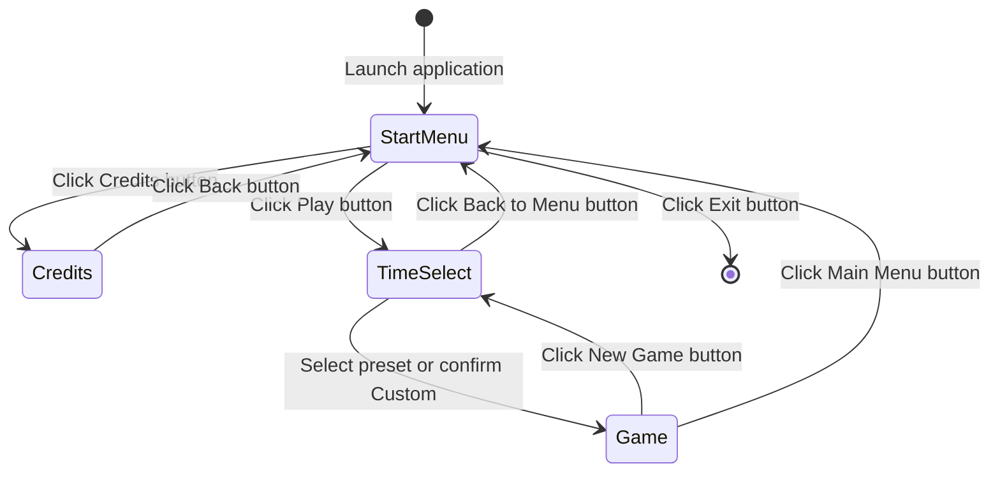
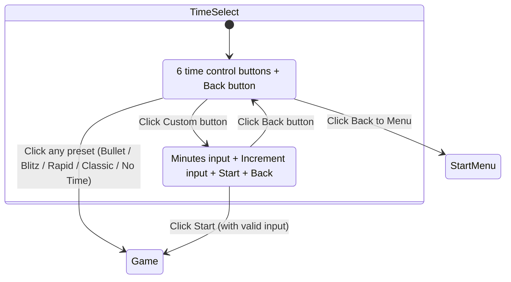
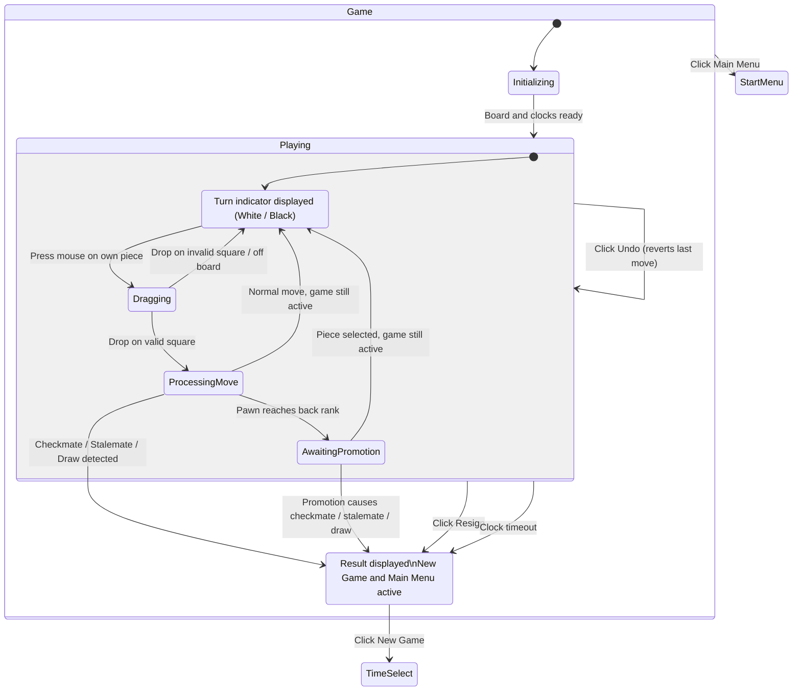

# Dialog Map

This document defines the UI state machine for the chess application, showing all screens, sub-states, and transitions. Each transition maps to a specific trigger event and functional requirement.

See also: [Boundary Classes](boundary-classes.md) | [Control Classes](control-classes.md) | [Functional Requirements](functional-requirements.md)

---

## Top-Level State Diagram

---

## TimeSelect Sub-States

The Time Control Selection screen has two internal sub-states managed by `TimeSelectScreen`.

---

## Game Sub-States

The Game screen contains the most complex state machine, handling piece interaction, move processing, promotion, and game-over conditions.

---

## Complete Transition Table

Every transition in the dialog map with its trigger event, source, destination, and functional requirement reference.

### Top-Level Transitions

| # | Source | Destination | Trigger Event | FR Reference |
|---|--------|-------------|---------------|-------------|
| T-01 | — | StartMenu | Application launch | FR-01.1 |
| T-02 | StartMenu | Credits | Click Credits button | FR-02.1 |
| T-03 | StartMenu | TimeSelect | Click Play button | FR-03.1 |
| T-04 | StartMenu | (exit) | Click Exit button | FR-01.3 |
| T-05 | Credits | StartMenu | Click Back button | FR-02.3 |
| T-06 | TimeSelect | StartMenu | Click Back to Menu button | FR-03.1 |
| T-07 | TimeSelect | Game | Select a preset time control | FR-03.4 |
| T-08 | TimeSelect | Game | Confirm custom time control | FR-03.4 |
| T-09 | Game (GameOver) | TimeSelect | Click New Game button | FR-15.3 |
| T-09a | Game | StartMenu | Click Main Menu button | FR-15.4 |

### TimeSelect Internal Transitions

| # | Source | Destination | Trigger Event | FR Reference |
|---|--------|-------------|---------------|-------------|
| T-10 | PresetSelection | CustomTimeEntry | Click Custom button | FR-03.3 |
| T-11 | CustomTimeEntry | PresetSelection | Click Back button | FR-03.3 |

### Game Internal Transitions

| # | Source | Destination | Trigger Event | FR Reference |
|---|--------|-------------|---------------|-------------|
| T-12 | Initializing | Playing (AwaitingInput) | Game initialization complete | FR-04.1, FR-04.2, FR-04.3 |
| T-13 | AwaitingInput | Dragging | Mouse press on own piece | FR-06.1, FR-06.6 |
| T-14 | Dragging | AwaitingInput | Mouse release on invalid square or off board | FR-06.5 |
| T-15 | Dragging | ProcessingMove | Mouse release on valid destination | FR-06.4 |
| T-16 | ProcessingMove | AwaitingInput | Move executed, game status is ACTIVE or CHECK | FR-07, FR-13.1 |
| T-17 | ProcessingMove | AwaitingPromotion | Pawn reaches opponent's back rank | FR-09.3.1, FR-09.3.2 |
| T-18 | ProcessingMove | GameOver | Checkmate detected | FR-10.3 |
| T-19 | ProcessingMove | GameOver | Stalemate detected | FR-10.4, FR-11.1 |
| T-20 | ProcessingMove | GameOver | Draw condition detected (insufficient material, threefold repetition, or fifty-move rule) | FR-11.2, FR-11.3, FR-11.4 |
| T-21 | AwaitingPromotion | AwaitingInput | Player selects promotion piece, game still active | FR-09.3.3 |
| T-22 | AwaitingPromotion | GameOver | Promotion results in checkmate, stalemate, or draw | FR-09.3.3, FR-10.3, FR-10.4 |
| T-23 | Playing | Playing | Click Undo button | FR-15.1 |
| T-24 | Playing | GameOver | Click Resign button | FR-15.2 |
| T-25 | Playing | GameOver | Active player's clock reaches 0:00 | FR-12.3 |

---

## State-to-Boundary Mapping

Cross-reference showing which boundary class renders each state:

| State | Boundary Class | Controller |
|-------|---------------|------------|
| StartMenu | `StartMenuScreen` | `ScreenNavigationController` |
| Credits | `CreditsScreen` | `ScreenNavigationController` |
| TimeSelect / PresetSelection | `TimeSelectScreen` | `ScreenNavigationController` |
| TimeSelect / CustomTimeEntry | `TimeSelectScreen` → `CustomTimeView` | `ScreenNavigationController` |
| Game / Initializing | `GameScreen` | `GameController` |
| Game / AwaitingInput | `GameScreen` + `BoardRenderer` | `InputController`, `GameController` |
| Game / Dragging | `GameScreen` + `BoardRenderer` (drag overlay) | `InputController` |
| Game / ProcessingMove | `GameScreen` (transient — no distinct visual) | `GameController`, `MoveValidator` |
| Game / AwaitingPromotion | `GameScreen` + `PromotionPopup` | `GameController` |
| Game / GameOver | `GameScreen` + `StatusBar` + `ActionButtonBar` | `GameController` |

---

## ScreenType Enum Alignment

Verification that the `ScreenType` enum values match the dialog map top-level states:

| ScreenType Value | Dialog Map State | Match |
|-----------------|-----------------|-------|
| `START_MENU` | StartMenu | Yes |
| `CREDITS` | Credits | Yes |
| `TIME_SELECT` | TimeSelect | Yes |
| `GAME` | Game | Yes |
