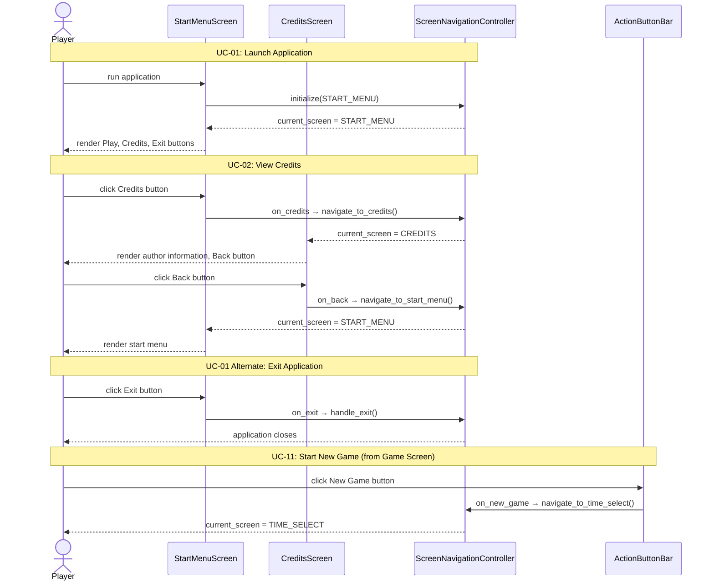
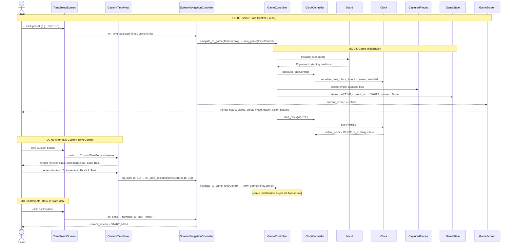
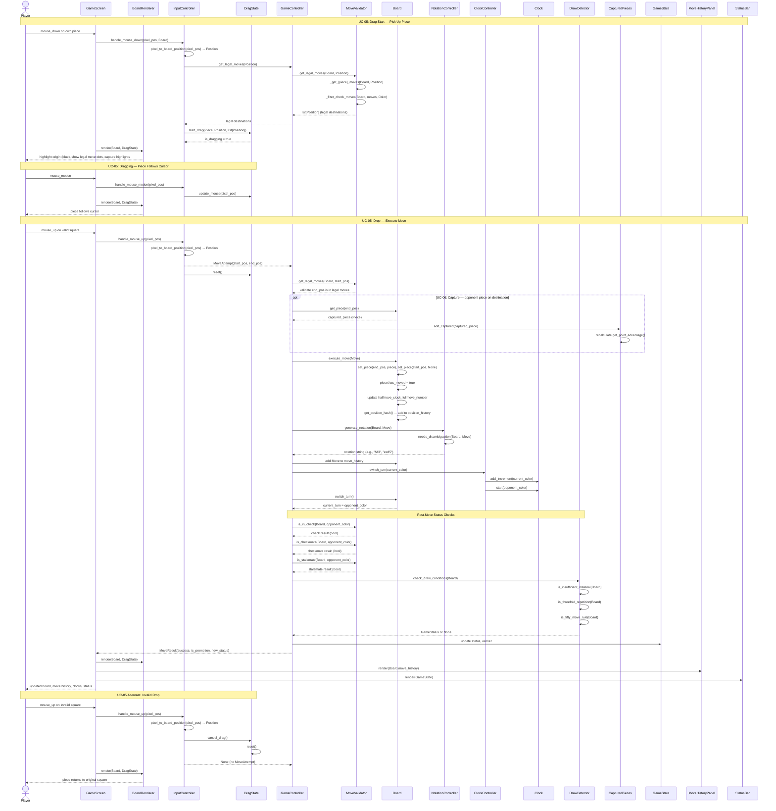
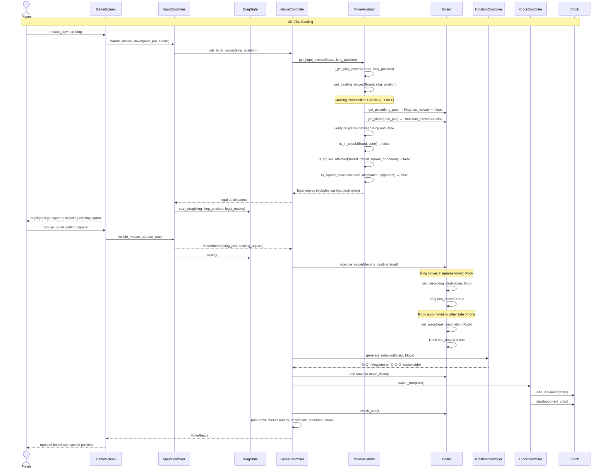
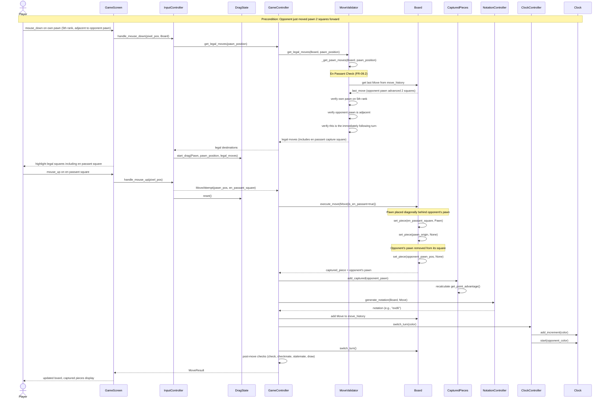
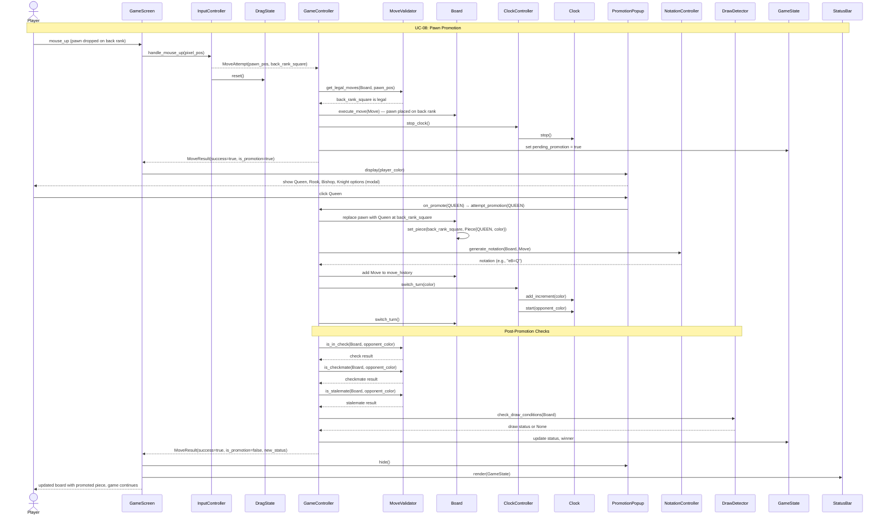
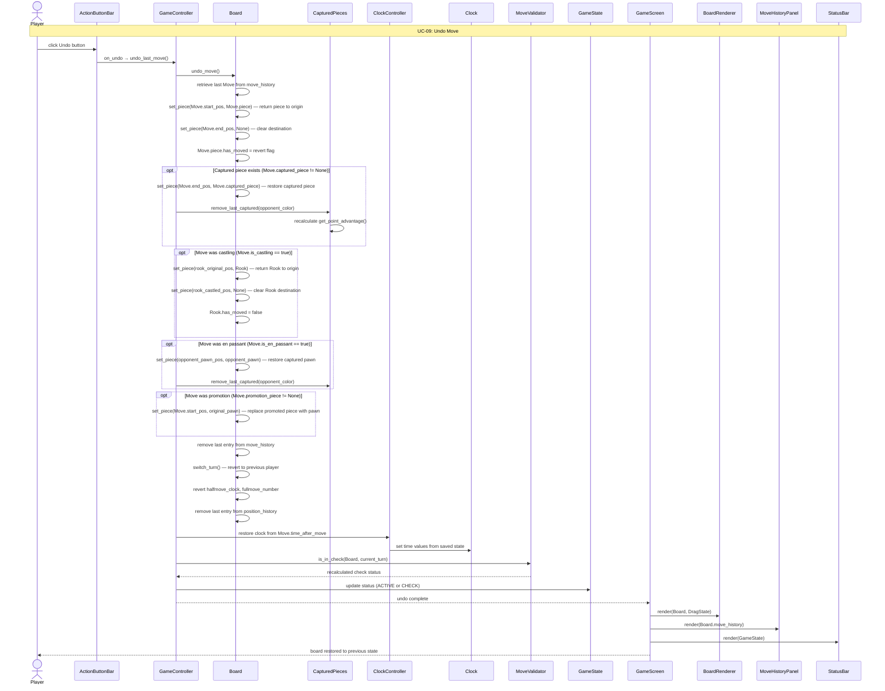
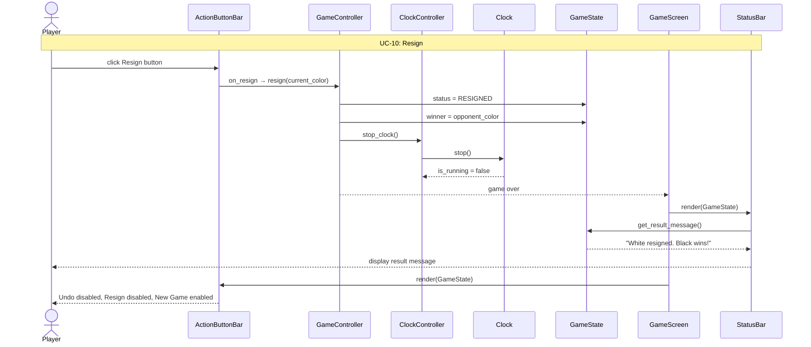
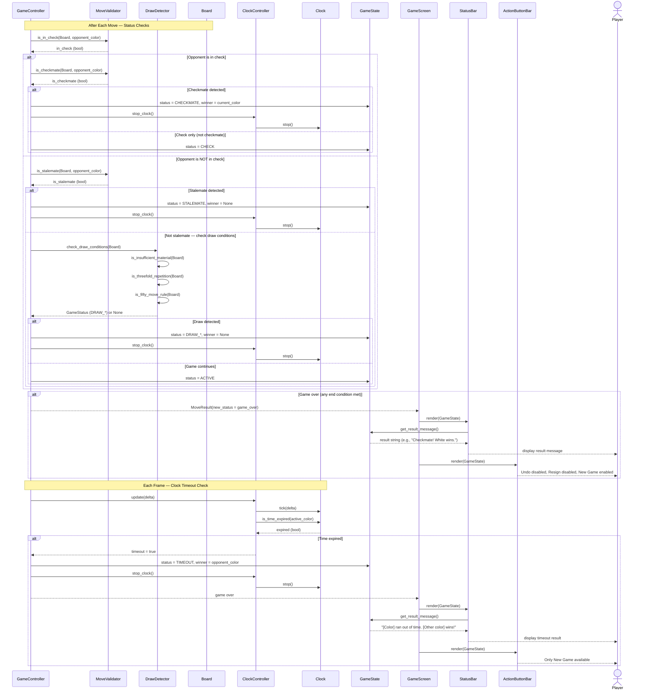

# Sequence Diagrams

This document contains UML sequence diagrams illustrating the interactions between actors, boundary classes, control classes, and entity classes for each use case in the chess application.

See also: [Use Case Model](use-case-model.md) | [Boundary Classes](boundary-classes.md) | [Control Classes](control-classes.md) | [Entity Class Diagram](class-diagram.md) | [Dialog Map](dialog-map.md)

---

## Diagram Index

| Diagram | Use Cases Covered |
|---------|-------------------|
| [1. Application Launch and Navigation](#1-application-launch-and-navigation-uc-01-uc-02-uc-11) | UC-01, UC-02, UC-11 |
| [2. Time Control Selection and Game Initialization](#2-time-control-selection-and-game-initialization-uc-03-uc-04) | UC-03, UC-04 |
| [3. Move Piece and Capture](#3-move-piece-and-capture-uc-05-uc-06) | UC-05, UC-06 |
| [4. Castling](#4-castling-uc-07a) | UC-07a |
| [5. En Passant](#5-en-passant-uc-07b) | UC-07b |
| [6. Pawn Promotion](#6-pawn-promotion-uc-08) | UC-08 |
| [7. Undo Move](#7-undo-move-uc-09) | UC-09 |
| [8. Resign](#8-resign-uc-10) | UC-10 |
| [9. Game End Conditions](#9-game-end-conditions) | Post-move checks |

---

## 1. Application Launch and Navigation (UC-01, UC-02, UC-11)

Covers launching the application, viewing credits, exiting, and starting a new game from the game screen.

---

## 2. Time Control Selection and Game Initialization (UC-03, UC-04)

Covers selecting a time control (preset or custom) and initializing a new game.

---

## 3. Move Piece and Capture (UC-05, UC-06)

Covers the core drag-and-drop move flow, including normal moves and captures, with full post-move processing.

---

## 4. Castling (UC-07a)

Covers both kingside and queenside castling with precondition validation.

---

## 5. En Passant (UC-07b)

Covers the en passant capture, including the prerequisite opponent pawn advance.

---

## 6. Pawn Promotion (UC-08)

Covers the pawn promotion flow with the modal promotion popup.

---

## 7. Undo Move (UC-09)

Covers reversing the last move and restoring all associated state.

---

## 8. Resign (UC-10)

Covers the resignation flow and game-over transition.

---

## 9. Game End Conditions

Covers the post-move checks performed after every move and the per-frame clock timeout check.

---

## Use Case to Diagram Traceability

| Use Case | Diagram | Primary Flow Shown |
|----------|---------|-------------------|
| UC-01: Launch Application | [Diagram 1](#1-application-launch-and-navigation-uc-01-uc-02-uc-11) | App launch, start menu display, exit |
| UC-02: View Credits | [Diagram 1](#1-application-launch-and-navigation-uc-01-uc-02-uc-11) | Credits navigation and return |
| UC-03: Select Time Control | [Diagram 2](#2-time-control-selection-and-game-initialization-uc-03-uc-04) | Preset and custom time selection |
| UC-04: Play Game | [Diagram 2](#2-time-control-selection-and-game-initialization-uc-03-uc-04) | Game initialization and board setup |
| UC-05: Move Piece | [Diagram 3](#3-move-piece-and-capture-uc-05-uc-06) | Full drag-and-drop flow with post-move checks |
| UC-06: Capture Piece | [Diagram 3](#3-move-piece-and-capture-uc-05-uc-06) | Capture as optional branch within move flow |
| UC-07a: Castling | [Diagram 4](#4-castling-uc-07a) | Castling preconditions and King/Rook execution |
| UC-07b: En Passant | [Diagram 5](#5-en-passant-uc-07b) | En passant validation and diagonal capture |
| UC-08: Promote Pawn | [Diagram 6](#6-pawn-promotion-uc-08) | Promotion popup, piece selection, replacement |
| UC-09: Undo Move | [Diagram 7](#7-undo-move-uc-09) | Full state reversal (board, clock, captures, flags) |
| UC-10: Resign | [Diagram 8](#8-resign-uc-10) | Resignation and game-over transition |
| UC-11: Start New Game | [Diagram 1](#1-application-launch-and-navigation-uc-01-uc-02-uc-11) | Navigation back to time select screen |
| Game End Conditions | [Diagram 9](#9-game-end-conditions) | Checkmate, stalemate, draw, timeout detection |
