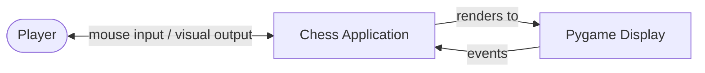
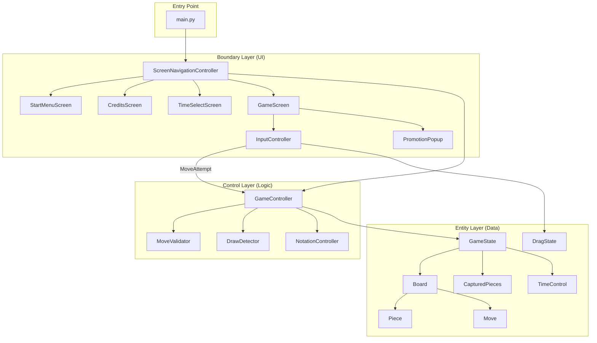
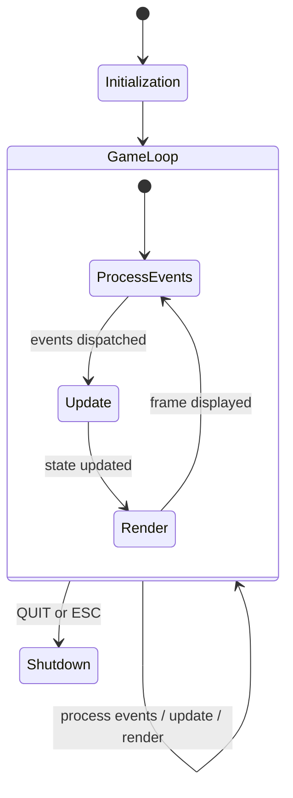

# System Architecture

This document describes the high-level system architecture of the chess application.

See also: [Class Diagram](class-diagram.md) | [Control Classes](control-classes.md) | [Boundary Classes](boundary-classes.md) | [Sequence Diagrams](sequence-diagrams.md)

---

## Architectural Pattern

The application follows a **three-layer architecture** separating data, logic, and presentation:

| Layer | Package | Responsibility | Dependencies |
|-------|---------|----------------|--------------|
| **Entity** | `src/entities/` | Pure data classes with minimal behavior. No game logic, no UI code. | None |
| **Control** | `src/controllers/` | Application and game logic. Validates moves, detects end conditions, manages navigation. | Entity |
| **Boundary** | `src/screens/`, `src/components/` | Pygame rendering and user input detection. Reads entities for display, emits callbacks to controllers. | Entity, Control |

Dependencies flow **downward only**: Boundary depends on Control and Entity; Control depends on Entity; Entity depends on nothing. This enforces a clean separation of concerns and makes the logic layer testable without any UI dependency.

---

## System Context



The application is a self-contained desktop program. There are no external services, databases, or network calls. All state lives in memory for the duration of a game session.

---

## Component Diagram



---

## Layer Details

### Entity Layer (`src/entities/`)

Pure data holders. Each class maps to a concept in the [Data Dictionary](data-dictionary.md). Key design decisions:

- **Board** uses an 8x8 2D array (`squares[row][col]`) where row 0 is rank 8 (Black's back rank) and row 7 is rank 1 (White's back rank).
- **Move** stores all metadata needed for undo: the moved piece, start/end positions, captured piece, special move flags (`is_castling`, `is_en_passant`, `promotion_piece`), and the prior `has_moved` state (`had_moved`).
- **Position** supports algebraic notation conversion and is hashable for use in sets and dicts.
- **GameState** is the top-level composite, owning the Board, TimeControl, CapturedPieces, and game status.

### Control Layer (`src/controllers/`)

Stateless (or near-stateless) logic classes. Each receives entity objects as parameters and returns results without side effects on the UI.

| Controller | Role |
|------------|------|
| **GameController** | Central orchestrator. Owns `GameState`. Receives `MoveAttempt` from UI, dispatches to `MoveValidator`, executes on `Board`, delegates to `DrawDetector` and `NotationController`, and returns `MoveResult`. |
| **MoveValidator** | Pure chess legality. Generates candidate moves per piece type, filters moves that leave the king in check, detects check/checkmate/stalemate. Stateless — operates on a `Board` parameter. |
| **DrawDetector** | Detects insufficient material, threefold repetition, and fifty-move rule. Stateless. |
| **NotationController** | Generates standard algebraic notation strings. Handles disambiguation, castling (`O-O`/`O-O-O`), and promotion (`=Q`). Stateless. |
| **ScreenNavigationController** | Manages screen transitions following the [Dialog Map](dialog-map.md). Owns the current screen instance. |
| **InputController** | Translates raw Pygame mouse events into `MoveAttempt` objects via `DragState`. |

### Boundary Layer (`src/screens/`, `src/components/`)

Pygame rendering and input detection. Each screen corresponds to a `ScreenType` enum value. Screens read from entity classes for display and emit signals (callbacks) to controllers for processing.

| Screen | Purpose |
|--------|---------|
| **StartMenuScreen** | Play, Credits, Exit buttons |
| **CreditsScreen** | Author display with Back button |
| **TimeSelectScreen** | 6 presets + custom time entry |
| **GameScreen** | Board rendering, drag-and-drop, status display, undo button, promotion popup, move history panel, captured pieces display with point advantage |

Reusable components (`Button`, `TextInput`, `PromotionPopup`) are shared across screens.

---

## Application Lifecycle



1. **Initialization**: `main.py` initializes Pygame, creates a fullscreen surface, and instantiates `ScreenNavigationController` (which creates the start menu screen).
2. **Game Loop**: Runs at 60 FPS. Each frame: process all Pygame events (dispatched to the current screen's `handle_event`), call `update(dt)` for time-based logic, call `draw()` to render, then `pygame.display.flip()`.
3. **Shutdown**: Triggered by `pygame.QUIT` event or ESC key. Calls `pygame.quit()` and exits.

---

## Move Execution Pipeline

The core data flow for executing a chess move:

```
Player drag-and-drop
    → InputController.handle_mouse_up()
    → MoveAttempt(start_pos, end_pos)
    → GameController.attempt_move()
        → MoveValidator.get_legal_moves() — validates legality
        → Detect special moves (en passant, castling, promotion)
        → Board.execute_move() — mutates board state
        → NotationController.generate_notation()
        → Board.switch_turn()
        → MoveValidator.is_in_check/checkmate/stalemate()
        → DrawDetector.check_draw_conditions()
    → MoveResult(success, is_promotion, new_status)
    → GameScreen updates display
```

For **pawn promotion**, the pipeline splits into two phases:
1. `attempt_move()` returns `MoveResult(is_promotion=True)` **before** switching turns.
2. `GameScreen` shows `PromotionPopup`. Player selects a piece type.
3. `attempt_promotion(piece_type)` completes the move: replaces the pawn, switches turns, and checks post-move status.

---

## Key Design Decisions

| Decision | Rationale |
|----------|-----------|
| **Stateless controllers** (MoveValidator, DrawDetector, NotationController) | Easier to test — pass in a Board, get a result. No hidden state to manage. |
| **Board.clone() via deepcopy** | MoveValidator needs to simulate moves to check for self-check. Cloning the board avoids mutating game state during validation. |
| **Move stores `had_moved` flag** | Enables correct undo of the `has_moved` state on pieces, which is critical for castling rights after undo. |
| **Separate `_get_king_attacks()` from `_get_king_moves()`** | Prevents infinite recursion: `is_square_attacked()` must not trigger castling checks (which themselves call `is_in_check()`). |
| **Position hash includes castling rights and en passant** | Required for correct threefold repetition detection per FIDE rules. Two board positions that differ only in castling availability are distinct positions. |
| **Two-phase promotion flow** | Keeps the `attempt_move` → `MoveResult` contract clean. The UI handles the modal selection, then calls back with the chosen piece type. |

---

## Technology Stack

| Component | Technology |
|-----------|-----------|
| Language | Python 3.8+ |
| GUI Framework | Pygame 2.5+ |
| Testing | pytest |
| Code Formatting | Black |
| Configuration | `pyproject.toml` |
